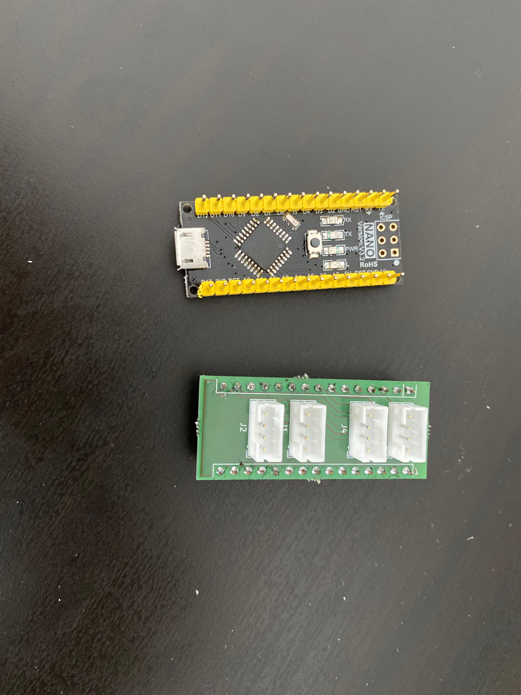
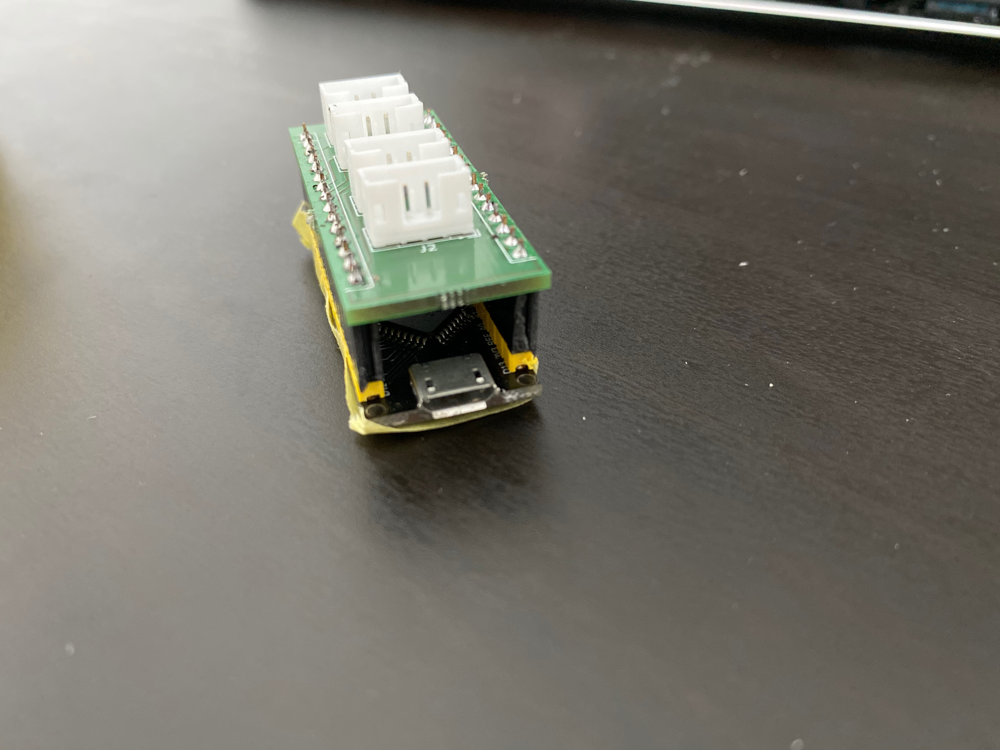
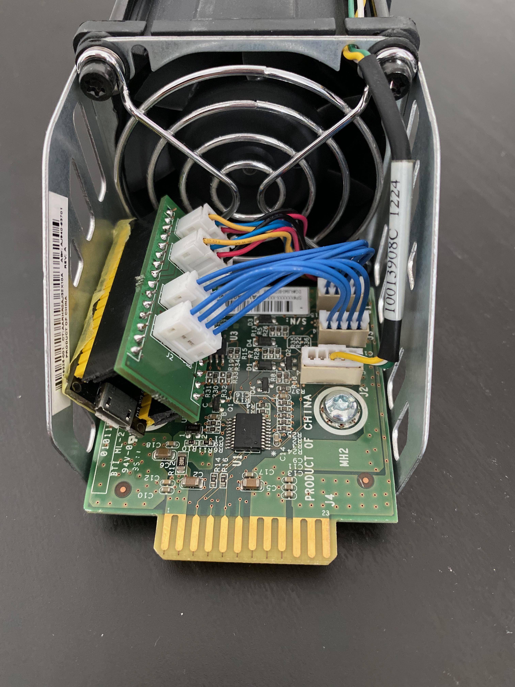
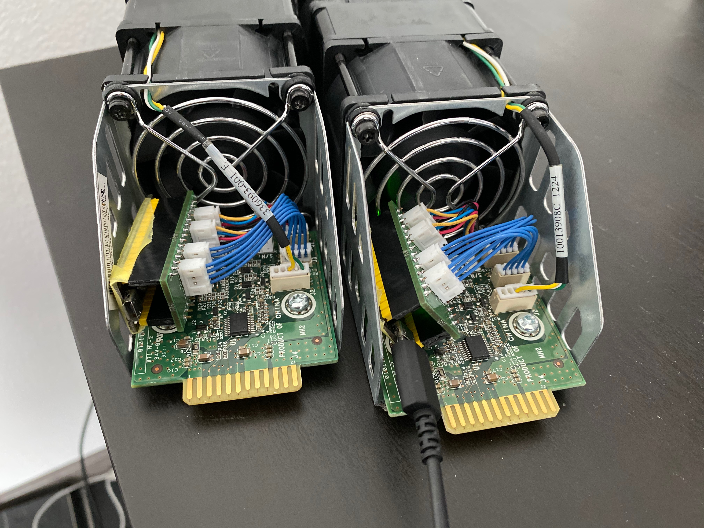

# NanoFan

A custom fan controller for HP D2600 based on Arduino Nano

It is a header for Arduino Nano. You connect the fans with the header and the header with the old fan plugs so that the Arduino acts like a man in the middle. 

The original fans could be controlled by a pwm signal and there is a fake rpm signal sent to the original controller.

## Disclaimer

I'm not responsible for anything that happens by building or using this project

## Images

## BOM

You need following per fan controller:

- 1x Arduino Nano

- 2x JUMPER 04KR-6S-P - 04KR-6S-P 2" (PN: A04KR04KR26E51B)

- 4x B4B-PH-K-S(LF)(SN)

- 1x PCB from this project

## Impressum

[Impressum](https://banjobyte.com/impressum.html)
